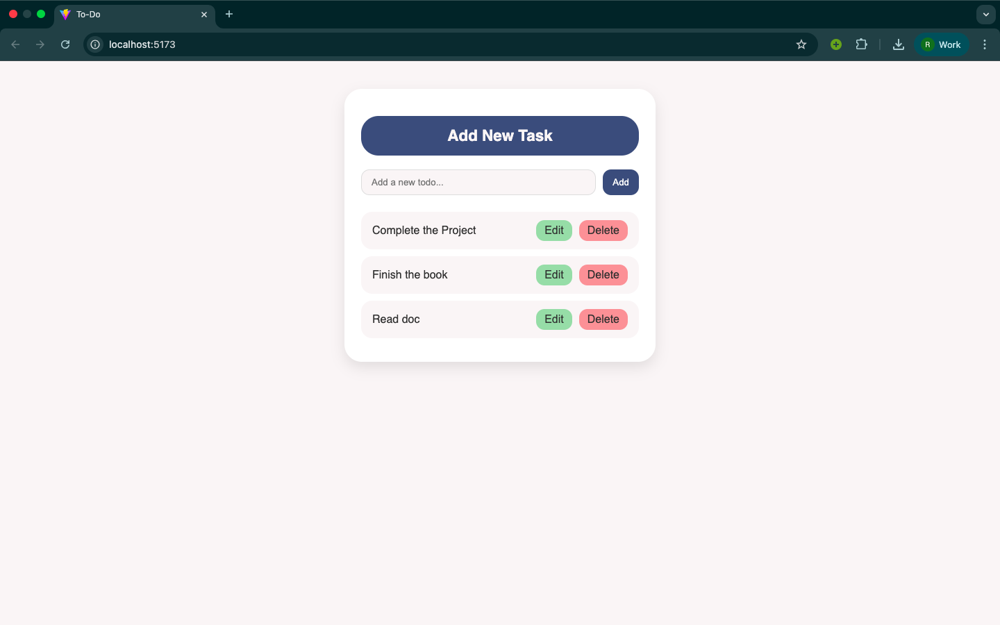
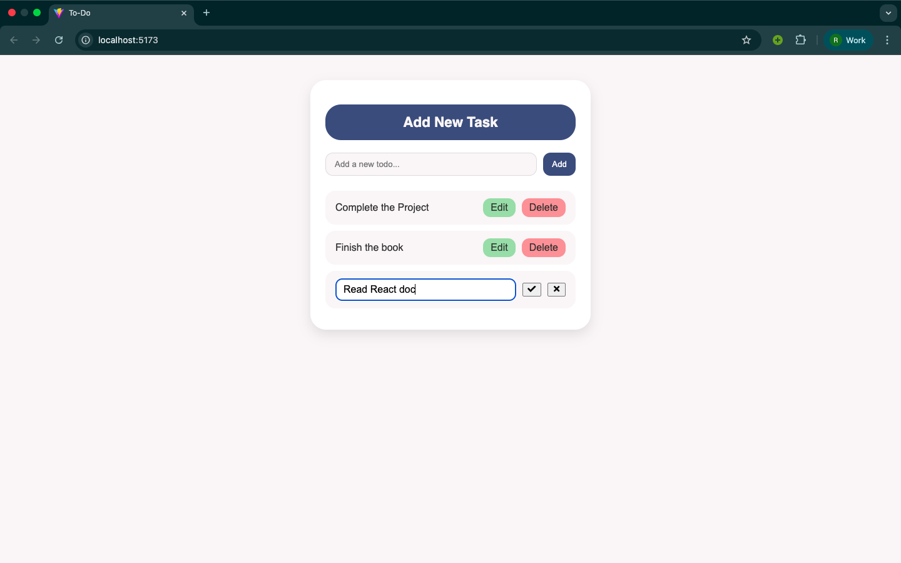
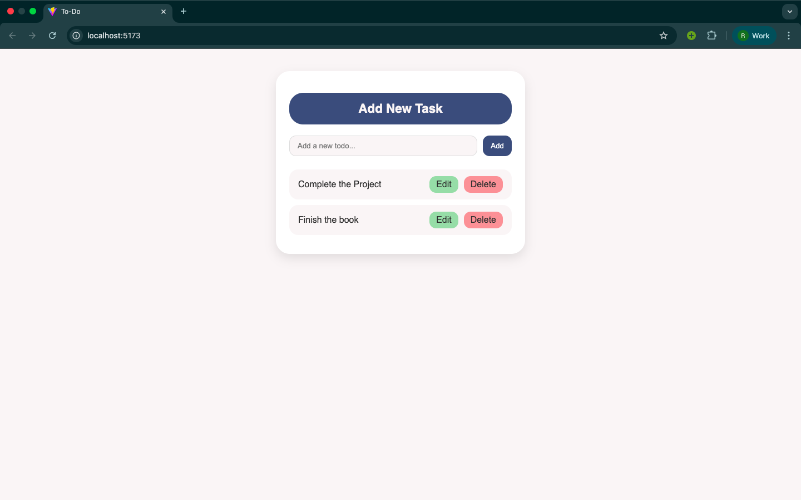

# Todo List (React + TypeScript)

## Project Description

This is a **Todo List** web application built using **React** and **TypeScript (TSX)**. The app allows users to:

- Add new tasks
- Edit existing tasks inline
- Delete tasks
- Get tasks saved using **localStorage**, so data remains after page refresh

---

## Screenshots

### Add Tasks

  
Tasks added to show app functionality.

### Edit Task

  
Edit mode allows changing task names with OK/Cancel options.

### Delete Task

  
Tasks deleted from the previous using the Delete button.

---

## Getting Started

### Prerequisites

- Node.js (v14+ recommended)
- npm or yarn package manager

### Installation and Running

1. Clone the repository:

   ```bash
   git clone https://github.com/Ruth652/todo-list-react.git
   ```

   ```bash
   cd todo-list-ts
   ```

2. Install dependencies:
   ```bash
   npm install
   ```

### or

```bash
 yarn install
```

3. Start the development server:

   ```bash
   npm start
   ```

### or

```bash
 yarn start
```

4. After starting the server, check your terminal for the exact local URL. Click the link or open it in your browser.
